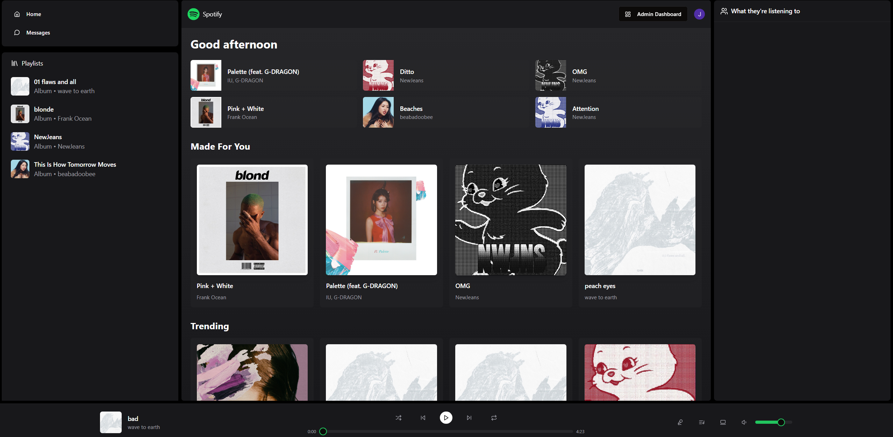
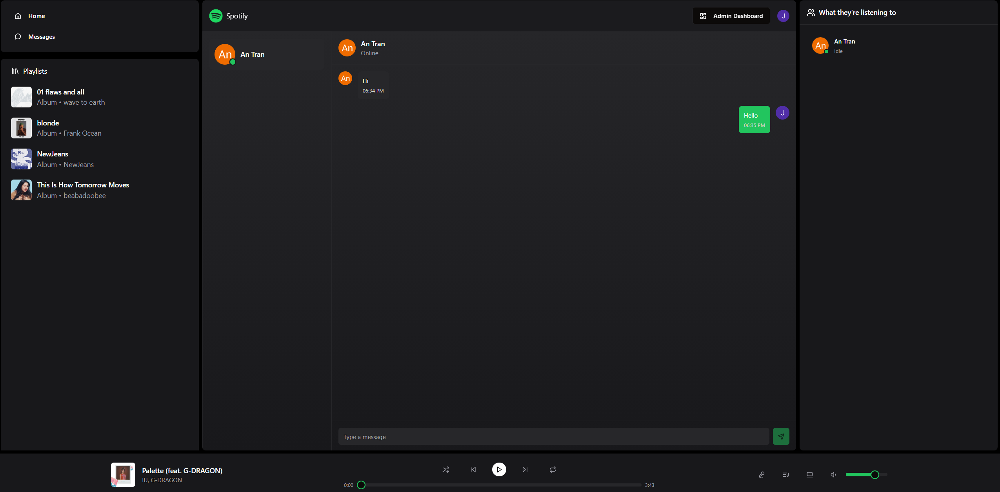
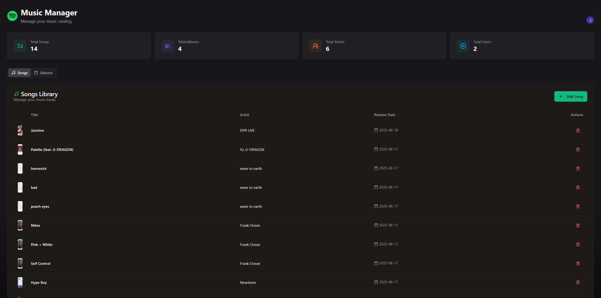

# Realtime Spotify Clone

A full-stack Spotify-inspired web application built with **React (Vite + TypeScript)** on the frontend and **Node.js (Express + MongoDB + Clerk + Socket.io)** on the backend.  
Supports real-time messaging, music streaming, and admin features.

## Features

- **Authentication & Authorisation**  
  Secure login/signup powered by [Clerk](https://clerk.com).

- **Music Management**  
  Upload songs and albums (with cover artwork & mp3 audio), manage metadata.

- **Realtime Chat**  
  Socket.io integration for live conversations between users.

- **Statistics Dashboard**  
  View total users, songs, albums, and unique artists with live updates.

- **Responsive UI**  
  Built with Vite + React, styled for both desktop and mobile.

- **Production-ready**  
  Deployed on [Render](https://realtime-spotify-clone-biik.onrender.com/), with CI/CD directly from GitHub.


## Tech Stack

**Frontend**
- React 18 + Vite + TypeScript  
- Zustand (state management)  
- Axios (API requests)  

**Backend**
- Node.js + Express  
- MongoDB + Mongoose  
- Clerk (auth)  
- Socket.io (real-time chat)  
- Express File Upload + Cloudinary (media storage)  
- Node-cron (cleanup jobs)  

**Deployment**
- Render (Web Service + MongoDB Atlas)


## Installation

### 1. Clone the repository
```bash
git clone https://github.com/jordann-trann/Realtime-Spotify-Clone.git
cd Realtime-Spotify-Clone

# Backend
npm install --prefix backend

# Frontend
npm install --prefix frontend
```

### 2. Set environment variables

Setup .env file in **_backend_** folder

```bash
PORT=...
MONGODB_URI=...
ADMIN_EMAIL=...
NODE_ENV=...

CLOUDINARY_API_KEY=...
CLOUDINARY_API_SECRET=...
CLOUDINARY_CLOUD_NAME=...


CLERK_PUBLISHABLE_KEY=...
CLERK_SECRET_KEY=...
```

Setup .env file in **_frontend_** folder

```bash
VITE_CLERK_PUBLISHABLE_KEY=...
```

### 3. Run in development

Start **_backend_**
```bash
npm start --prefix backend
```

Start **_frontend_**
```bash
npm run dev --prefix backend
```

### 4. Build for production
```bash
npm run build
npm start
```

## Deployment
The project is live here [Realtime Spotify Clone](https://realtime-spotify-clone-biik.onrender.com)


## Screenshots

### Home Page


### Chat Page


### Admin Page



